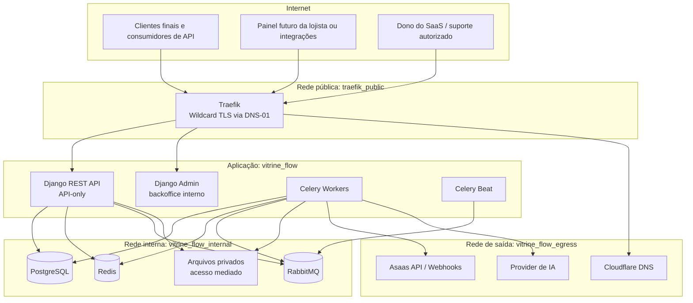
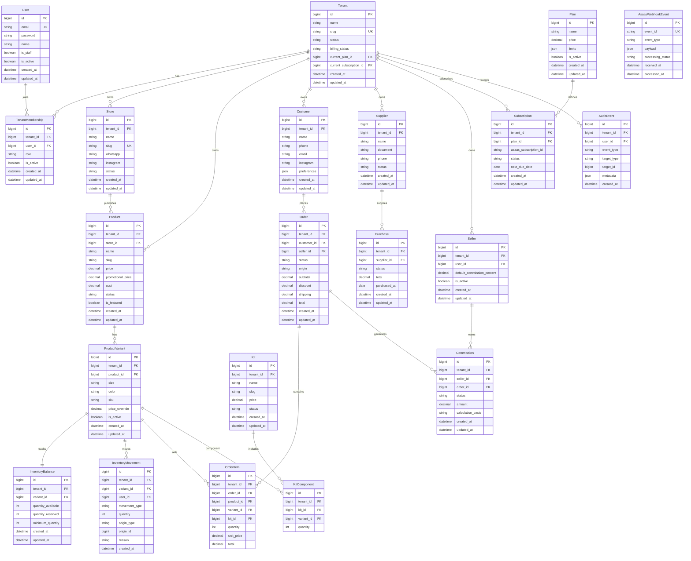
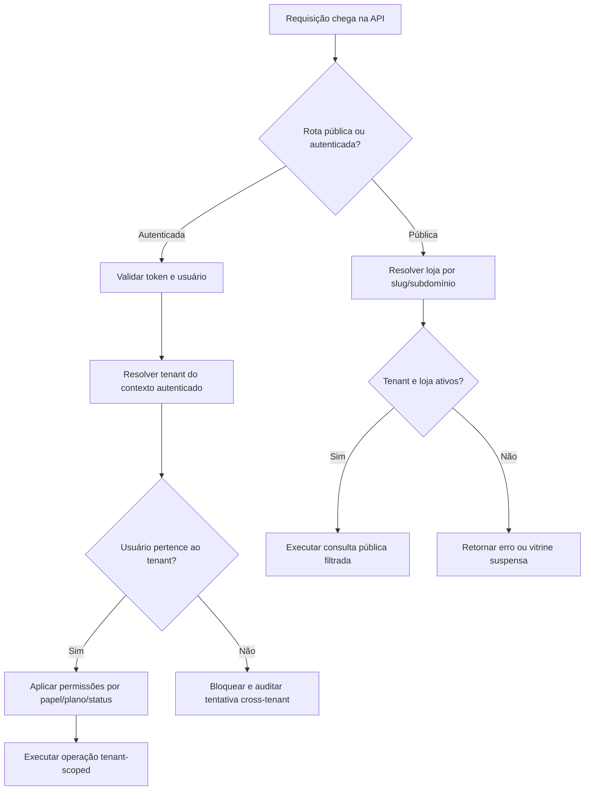
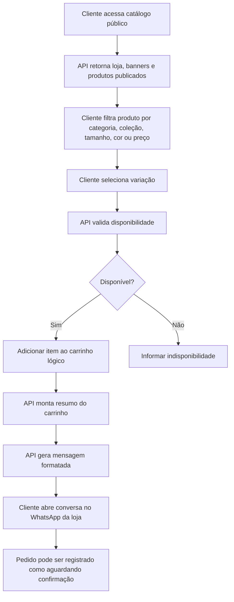
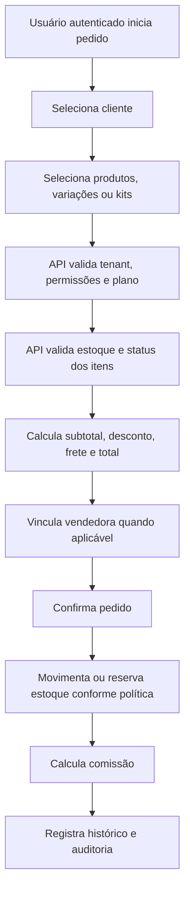
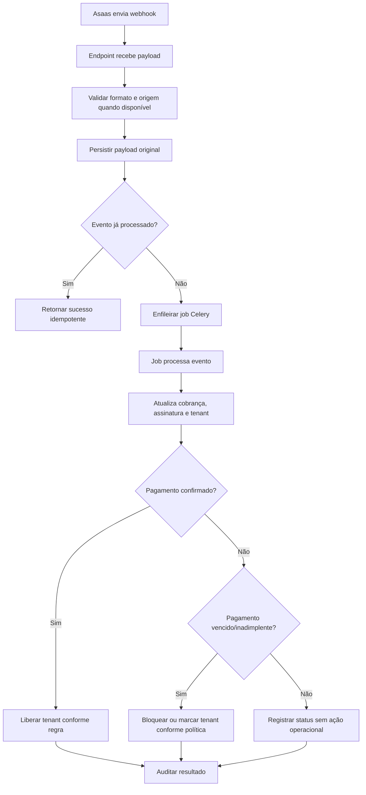
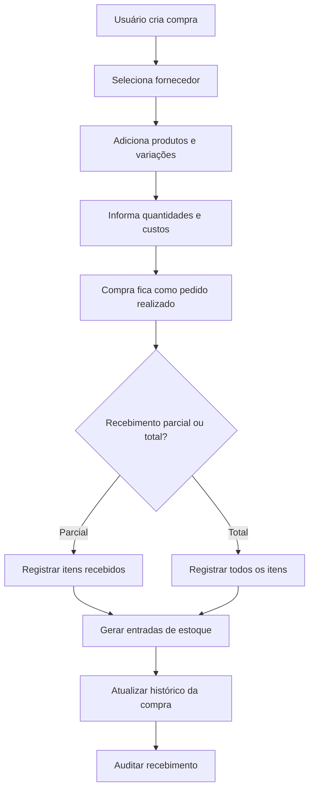
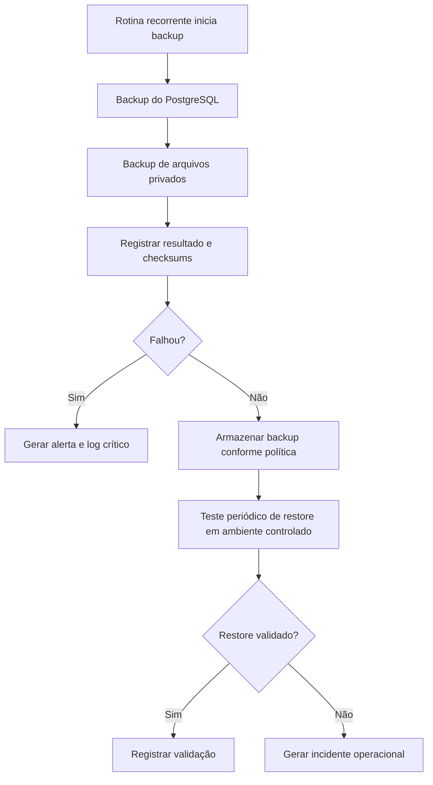

# PRD — VitrineFlow

> **Versão:** 1.0
> **Data:** 2026-07-10
> **Status:** Aprovado para planejamento técnico e implementação futura

---

## 1. Visão Geral do Produto

### 1.1 Identidade

| Item | Valor |
|---|---|
| **Nome do produto** | VitrineFlow |
| **Slug técnico** | `vitrine_flow` |
| **Tipo de produto** | SaaS API-only multi-tenant |
| **Público principal** | Pequenas lojas de moda que vendem por Instagram e WhatsApp |
| **Backoffice interno obrigatório** | Django Admin |
| **Acesso de tenants ao Django Admin** | Proibido |

### 1.2 Descrição

O VitrineFlow é um SaaS API-only, multi-tenant, voltado para pequenas lojas de moda que vendem principalmente por Instagram e WhatsApp. O produto deverá entregar catálogo público consumível por API, gestão operacional da loja, controle de produtos, variações, estoque, kits, clientes, pedidos, fornecedores, compras, vendedoras, comissões, stories, relatórios, recursos de IA, planos, assinaturas e cobrança recorrente via Asaas.

O dono do SaaS deverá administrar tenants, planos, assinaturas, cobranças, inadimplência, uso da plataforma, suporte operacional e relatórios administrativos pelo Django Admin. O Django Admin será um backoffice interno exclusivo do dono do SaaS e da equipe autorizada; lojistas, vendedoras e demais usuários de tenant não poderão acessá-lo.

### 1.3 Problema que Resolve

Pequenas lojas de moda costumam vender bem em canais conversacionais, mas operam com catálogo improvisado, estoque manual, falta de histórico de clientes, pouca previsibilidade de compras, ausência de relatórios e controle frágil de pedidos. O VitrineFlow resolve essa lacuna sem transformar a operação em um ERP pesado: entrega catálogo profissional e gestão comercial suficiente para organizar a rotina da loja, mantendo o WhatsApp como canal de conversão do MVP.

### 1.4 Proposta de Valor

- **Para lojistas:** catálogo profissional, estoque por variação, pedidos, clientes, compras, vendedoras, comissões e relatórios em uma base operacional única.
- **Para vendedoras:** consulta rápida de produtos disponíveis, registro de pedidos, links compartilháveis e comissão rastreável.
- **Para clientes finais:** experiência simples de catálogo público, carrinho via API e finalização pelo WhatsApp.
- **Para o dono do SaaS:** gestão centralizada de tenants, planos, assinaturas, inadimplência, suporte e uso da plataforma pelo Django Admin.
- **Diferencial técnico:** arquitetura API-only, multi-tenant explícita, cobrança recorrente via Asaas, isolamento por tenant, deploy profissional em Docker Swarm com Traefik e documentação técnica completa.

### 1.5 Oportunidade

O VitrineFlow se posiciona entre catálogos simples e ERPs complexos. O produto deverá atender lojas com baixa maturidade operacional, mas com necessidade real de organização, controle e inteligência comercial. O MVP deverá evitar complexidade visual e priorizar a construção de uma API sólida, documentada e segura, preparada para futuros frontends, aplicativos, automações e integrações.

### 1.6 Premissas Técnicas

- O produto será API-only no MVP.
- Não haverá frontend visual acoplado ao backend no MVP.
- O catálogo público será consumido por API por uma camada cliente futura ou por integrações.
- O pagamento do cliente final da loja não será processado pelo Asaas no MVP.
- O Asaas será usado para cobrança recorrente da assinatura do SaaS.
- Instagram será tratado de forma manual ou semiassistida no MVP.
- Toda regra operacional de loja deverá ser tenant-scoped.
- Todo acesso excepcional de suporte a dados de uma loja deverá ser auditado.
- Valores ainda não definidos deverão permanecer como placeholders explícitos apenas quando já existirem no material-fonte.

---

## 2. Público-Alvo, Personas e Escopo

### 2.1 Segmentos Atendidos

- Marcas pequenas de moda fitness feminina.
- Lojas de moda feminina.
- Boutiques.
- Ateliês.
- Revendedoras.
- Lojas de moda praia.
- Lojas de moda casual.
- Lojas de acessórios.
- Lojas de semijoias.
- Negócios que vendem por Instagram e WhatsApp.
- Dono do SaaS VitrineFlow.
- Equipe interna de suporte e financeiro do SaaS.

### 2.2 Personas

#### Persona 1 — Dona da Loja

| Atributo | Detalhe |
|---|---|
| **Nome fictício** | Larissa, 32 anos |
| **Cargo / contexto** | Dona de uma loja de moda feminina que vende pelo Instagram e fecha pedidos no WhatsApp |
| **Dor principal** | Perde vendas por falta de catálogo organizado, estoque confiável e histórico de clientes |
| **O que busca** | Uma forma simples de organizar produtos, pedidos, estoque e vendas sem operar um ERP complexo |
| **Habilidade técnica** | Básica |
| **Ações no sistema** | Configurar loja, cadastrar produtos, controlar estoque, acompanhar pedidos, consultar relatórios e gerenciar assinatura |

#### Persona 2 — Vendedora

| Atributo | Detalhe |
|---|---|
| **Nome fictício** | Camila, 24 anos |
| **Cargo / contexto** | Vendedora que atende clientes pelo Instagram Direct e WhatsApp |
| **Dor principal** | Não sabe rapidamente o que tem em estoque e não tem rastreio claro de comissão |
| **O que busca** | Consultar disponibilidade, montar pedidos e acompanhar comissões |
| **Habilidade técnica** | Básica |
| **Ações no sistema** | Consultar produtos, criar pedidos, vincular clientes, compartilhar links e acompanhar comissões próprias |

#### Persona 3 — Cliente Final

| Atributo | Detalhe |
|---|---|
| **Nome fictício** | Bruna, 28 anos |
| **Cargo / contexto** | Compradora que descobre produtos pelo Instagram |
| **Dor principal** | Precisa perguntar disponibilidade, preço, tamanho e cor manualmente |
| **O que busca** | Ver produtos disponíveis, montar interesse de compra e falar com a loja no WhatsApp |
| **Habilidade técnica** | Básica |
| **Ações no sistema** | Acessar catálogo público, filtrar produtos, montar carrinho e finalizar via WhatsApp |

#### Persona 4 — Dono do SaaS

| Atributo | Detalhe |
|---|---|
| **Nome fictício** | Rafael, 37 anos |
| **Cargo / contexto** | Operador e administrador do VitrineFlow |
| **Dor principal** | Precisa controlar tenants, planos, cobranças, inadimplência, suporte e uso da plataforma |
| **O que busca** | Backoffice interno seguro e auditável |
| **Habilidade técnica** | Intermediária |
| **Ações no sistema** | Gerenciar tenants, planos, assinaturas, webhooks, bloqueios, liberações, suporte e relatórios administrativos |

### 2.3 Dores Principais

- Catálogo improvisado em PDF, Instagram ou conversas de WhatsApp.
- Falta de catálogo profissional com carrinho.
- Estoque incorreto por tamanho, cor e variação.
- Falta de histórico de pedidos.
- Falta de histórico de clientes.
- Falta de controle de lucro e margem estimada.
- Produtos parados sem análise.
- Kits vendidos manualmente sem baixa correta de estoque.
- Vendedoras sem rastreio de comissão.
- Compras de fornecedor sem registro.
- Cliente perguntando manualmente se determinado produto está disponível.
- Falta de relatórios de produtos mais vendidos, giro e preferências de clientes.
- Falta de gestão de assinaturas do próprio SaaS.
- Falta de automação para bloqueio e liberação por pagamento.
- Falta de controle sobre uso da plataforma por tenant.

### 2.4 Escopo Principal do MVP

O MVP deverá contemplar:

- SaaS API-only multi-tenant.
- Gestão de tenants.
- Gestão de planos.
- Gestão de assinaturas.
- Cobrança recorrente via Asaas.
- Bloqueio e liberação automática de tenants conforme status financeiro.
- Backoffice interno via Django Admin.
- Catálogo público consumido por API.
- Produtos, categorias, coleções, variações e imagens.
- Controle de estoque por tamanho, cor e variação.
- Kits de produtos.
- Clientes.
- Pedidos.
- Carrinho lógico com finalização via WhatsApp.
- Fornecedores.
- Compras.
- Vendedoras.
- Comissões.
- Stories de produto.
- Integração manual ou semiassistida com Instagram.
- Relatórios comerciais, financeiros e operacionais.
- Endpoints para recursos de IA.
- Auditoria.
- Notificações.
- Documentação OpenAPI/Swagger com drf-spectacular.
- Documentação técnica com MKDocs.
- Deploy em Docker Swarm com Traefik, Cloudflare DNS-01 e redes isoladas.
- Backups recorrentes e restore validado.
- Testes automatizados obrigatórios.

### 2.5 Fora do Escopo Inicial

Os seguintes itens estão explicitamente fora do MVP:

- Frontend visual.
- React.
- Vue.
- Next.js.
- Angular.
- Django Templates.
- Editor drag-and-drop.
- Marketplace entre lojas.
- Emissão fiscal obrigatória.
- App mobile.
- Templates ilimitados.
- Integração automática com Instagram.
- Sincronização automática de posts, reels ou métricas do Instagram.
- Checkout completo de pagamento para cliente final.
- Split de pagamento para lojistas.
- Exposição pública direta de arquivos.
- Acesso de tenants ao Django Admin.
- Substituição do Django Admin por painel visual próprio.

---

## 3. Arquitetura do Sistema

### 3.1 Stack Técnica Obrigatória

| Camada | Tecnologia / Regra |
|---|---|
| **Linguagem** | Python > 3.13 |
| **Framework** | Django >= 6.0 |
| **API** | Django REST Framework |
| **Documentação API** | drf-spectacular + Swagger |
| **Banco de dados** | PostgreSQL |
| **Cache / apoio operacional** | Redis |
| **Filas** | Celery |
| **Broker** | RabbitMQ |
| **Deploy** | Docker + Docker Swarm |
| **Proxy / roteamento** | Traefik |
| **DNS / certificados** | Cloudflare DNS + wildcard TLS via DNS-01 |
| **Billing** | Asaas para cobrança recorrente do SaaS |
| **Documentação técnica** | MKDocs |
| **Backoffice interno** | Django Admin |

### 3.2 Identidade de Deploy

| Item | Valor |
|---|---|
| **Stack Docker Swarm** | `vitrine_flow` |
| **Domínio de produção** | `[PREENCHER_DOMINIO_PRODUCAO_EX: vitrineflow.com.br]` |
| **Imagem da aplicação** | `[PREENCHER_REGISTRY_IMAGE_EX: ghcr.io/seu-usuario/vitrine_flow:latest]` |
| **Rede pública Traefik** | `traefik_public` |
| **Rede interna isolada** | `vitrine_flow_internal` |
| **Rede de saída externa** | `vitrine_flow_egress` |
| **Docker Secret Cloudflare** | `CLOUDFLARE_DNS_API_TOKEN` |

### 3.3 Diagrama de Arquitetura Geral



### 3.4 Separação de Superfícies

| Superfície | Uso | Acesso |
|---|---|---|
| **API pública do catálogo** | Loja pública, produtos publicados, variações disponíveis, stories, carrinho e WhatsApp | Público, limitado por dados publicados e status da loja |
| **API autenticada do tenant** | Gestão da loja, produtos, estoque, pedidos, clientes, compras, fornecedores, vendedoras, comissões e relatórios | Usuários do tenant com permissões |
| **API interna do SaaS** | Operações administrativas, suporte, relatórios globais e automações internas | Dono do SaaS e equipe interna autorizada |
| **Django Admin** | Backoffice interno do dono do SaaS | Usuários internos autorizados, nunca tenants |

### 3.5 Regras Obrigatórias de Deploy

- A aplicação deverá ser executada em Docker Swarm.
- O Traefik será o único componente exposto na rede pública.
- PostgreSQL, Redis, RabbitMQ, Celery workers e Celery Beat não poderão estar na rede pública.
- Serviços internos não deverão ser expostos diretamente.
- Secrets não deverão ser versionados em `.env`.
- O wildcard TLS deverá usar DNS-01.
- HTTP-01 e TLS-01 não deverão ser usados para wildcard TLS.
- O secret Cloudflare deverá ser gerenciado por Docker Secret.
- Arquivos privados não deverão ser expostos publicamente.
- Backups e restore deverão estar documentados e validados.

### 3.6 Separação de Ambientes

| Ambiente | Objetivo | Regras |
|---|---|---|
| **Local** | Desenvolvimento e testes | Pode usar Docker Compose/Sail equivalente apenas como apoio local, sem alterar o alvo de produção |
| **Staging** | Validação de deploy, webhooks, restore e segurança | Deve simular redes, secrets e Traefik da produção |
| **Produção** | Operação real do SaaS | Deve usar Docker Swarm, Traefik, DNS-01, secrets, logs, backups e monitoramento |

---

## 4. Modelo Multi-Tenant, Perfis e Permissões

### 4.1 Definição de Tenant

Cada tenant representa uma empresa cliente do SaaS. Um tenant poderá possuir uma ou mais configurações de loja conforme o plano contratado. Exemplos: marca de moda fitness feminina, boutique, revendedora, loja de moda praia ou loja de semijoias.

### 4.2 Estratégia Multi-Tenant

| Aspecto | Decisão |
|---|---|
| **Modelo** | Shared database, shared schema, isolamento por FK para `Tenant` |
| **Resolução inicial** | Slug/subdomínio com contexto autenticado para rotas privadas |
| **Domínio customizado** | Preparado para evolução futura |
| **Obrigatoriedade** | Todo modelo operacional deverá possuir vínculo direto ou indireto com tenant |
| **Validação** | QuerySets, services, permissions e testes deverão validar tenant explicitamente |

### 4.3 Dados Obrigatoriamente Tenant-Scoped

Todos os modelos de negócio relacionados à operação da loja deverão estar vinculados a um tenant, incluindo:

- Usuários do tenant.
- Loja.
- Produtos.
- Categorias.
- Coleções.
- Variações.
- Estoque.
- Kits.
- Clientes.
- Pedidos.
- Itens de pedido.
- Fornecedores.
- Compras.
- Vendedoras.
- Comissões.
- Conteúdos.
- Stories.
- Relatórios.
- Configurações.
- Eventos de auditoria.
- Arquivos privados.
- Notificações operacionais.
- Jobs com contexto de tenant.

### 4.4 Regras Obrigatórias de Isolamento

- Um tenant nunca poderá acessar dados de outro tenant.
- QuerySets deverão ser filtrados por tenant.
- Services deverão validar tenant explicitamente antes de executar mutações.
- Managers e QuerySets customizados deverão ser usados onde reduzirem risco de vazamento.
- Permissões deverão considerar tenant, papel, plano e status da conta.
- Testes automatizados deverão validar isolamento entre tenants.
- Rotas autenticadas deverão exigir contexto de tenant.
- Jobs assíncronos deverão carregar contexto de tenant explicitamente.
- Arquivos privados deverão ser segregados por tenant.
- Relatórios de tenant nunca deverão agregar dados de outros tenants.
- Apenas o dono do SaaS e equipe autorizada poderão visualizar dados administrativos multi-tenant pelo Django Admin.

### 4.5 Perfis de Usuário

| Perfil | Acesso | Permissões principais |
|---|---|---|
| **Dono do SaaS** | Django Admin, API interna | Gerenciar tenants, planos, assinaturas, cobranças, inadimplência, equipe interna, auditoria e métricas globais |
| **Suporte/financeiro do SaaS** | Django Admin limitado | Consultar tenant, status de assinatura, cobranças, webhooks, logs e desbloqueios controlados |
| **Dono da loja** | API autenticada do tenant | Configurar loja, produtos, estoque, pedidos, clientes, fornecedores, compras, vendedoras, comissões, relatórios e usuários |
| **Administrador da loja** | API autenticada do tenant | Operar catálogo, estoque, pedidos, clientes, compras, conteúdo e relatórios permitidos |
| **Vendedora** | API autenticada do tenant | Criar pedidos, consultar produtos, vincular clientes, compartilhar links e consultar comissões próprias |
| **Operador de estoque** | API autenticada do tenant | Registrar entradas, saídas, ajustes, conferência de compras e movimentações |
| **Cliente final** | API pública do catálogo | Visualizar loja, produtos, variações, stories e montar carrinho para WhatsApp |

### 4.6 Acesso de Suporte

Qualquer acesso da equipe interna do SaaS a dados operacionais de uma loja deverá ser excepcional, rastreável e restrito por permissão. O registro de auditoria deverá conter:

- Usuário interno responsável.
- Tenant afetado.
- Data e hora.
- Motivo informado.
- Tipo de acesso realizado.
- Ação executada.
- Origem da requisição.
- Resultado da operação.

### 4.7 Matriz de Permissões Resumida

| Recurso | Dono SaaS | Suporte SaaS | Dono Loja | Admin Loja | Vendedora | Estoque | Cliente |
|---|---:|---:|---:|---:|---:|---:|---:|
| Django Admin | Sim | Limitado | Não | Não | Não | Não | Não |
| Tenants | Sim | Consulta limitada | Não | Não | Não | Não | Não |
| Planos e assinaturas | Sim | Consulta limitada | Consulta própria | Não | Não | Não | Não |
| Produtos e catálogo | Consulta/auditoria | Excepcional auditado | Sim | Sim | Consulta | Consulta | Público publicado |
| Estoque | Consulta/auditoria | Excepcional auditado | Sim | Sim | Consulta | Sim | Não |
| Pedidos | Consulta/auditoria | Excepcional auditado | Sim | Sim | Criar/consultar permitidos | Consulta operacional | Não |
| Comissões | Consulta/auditoria | Excepcional auditado | Sim | Sim | Próprias | Não | Não |
| Relatórios globais SaaS | Sim | Limitado | Não | Não | Não | Não | Não |
| Relatórios do tenant | Excepcional auditado | Excepcional auditado | Sim | Permitido | Limitado | Limitado | Não |

---

## 5. Modelo de Dados

### 5.1 Diagrama ER Principal



### 5.2 Entidades por Domínio

| Domínio | Entidades principais | Observações |
|---|---|---|
| **Tenancy** | Tenant, TenantMembership, TenantDomain, TenantUsage | Base de isolamento e limites |
| **Accounts** | User, Role, Permission, PasswordReset, AuthAudit | Usuários internos e usuários de tenant separados por permissão |
| **Billing** | Plan, PlanLimit, Subscription, Charge, AsaasWebhookEvent, BillingAudit | Cobrança recorrente do SaaS via Asaas |
| **Stores** | Store, StoreSetting, StoreTheme, StorePolicy | Configuração pública da loja |
| **Catalog** | Product, ProductVariant, Category, Collection, ProductImage, ProductTag | Catálogo público e gestão de produtos |
| **Inventory** | InventoryBalance, InventoryMovement, StockReservation | Estoque por variação e movimentações imutáveis |
| **Kits** | Kit, KitComponent | Disponibilidade calculada por componentes |
| **Customers** | Customer, CustomerTag, CustomerPreference | Histórico e preferências com atenção à LGPD |
| **Orders** | Order, OrderItem, OrderStatusHistory, CartSnapshot | Pedido manual, pedido via catálogo e WhatsApp |
| **Suppliers** | Supplier | Fornecedores por tenant |
| **Purchases** | Purchase, PurchaseItem, PurchaseAttachment | Compras, recebimento e anexos privados |
| **Commissions** | Seller, CommissionRule, Commission, CommissionPayment | Regras, cálculo e pagamento |
| **Content** | Story, Banner, CampaignContent, MediaAsset | Stories, banners e conteúdo comercial |
| **Reports** | ReportRequest, ReportSnapshot | Relatórios operacionais e administrativos |
| **Notifications** | Notification, NotificationRead | Eventos e avisos internos |
| **AI** | AIInsightRequest, AIInsightResult, AIPromptLog | Sugestões e insights por tenant |
| **Audit** | AuditEvent, SupportAccessLog | Rastreabilidade e suporte auditado |

### 5.3 Regras de Modelagem

- Models operacionais deverão possuir `tenant_id`, exceto entidades globais como `Plan`.
- Entidades globais acessíveis por tenants deverão ter uso controlado por permissões e limites.
- Movimentações de estoque deverão ser imutáveis; correções deverão gerar nova movimentação.
- Histórico financeiro e de billing deverá ser preservado após cancelamento.
- Dados pessoais deverão ser minimizados e protegidos.
- Campos de custo, margem e observações internas nunca deverão aparecer na API pública.
- Arquivos privados deverão ter metadados tenant-scoped e acesso mediado pela aplicação.
- Eventos externos do Asaas deverão manter payload original para auditoria.

---

## 6. Apps e Módulos Django

### 6.1 Estrutura Sugerida

```text
vitrine_flow/
├── core/
├── base/
├── accounts/
├── tenancy/
├── billing/
├── stores/
├── catalog/
├── inventory/
├── orders/
├── customers/
├── suppliers/
├── purchases/
├── commissions/
├── content/
├── reports/
├── notifications/
├── ai/
└── audit/
```

### 6.2 Responsabilidades

| App | Responsabilidade |
|---|---|
| `core` | Configurações centrais, utilitários globais, responses padronizadas, logging e healthchecks |
| `base` | Models abstratos, mixins, timestamps, tenant mixins e padrões compartilhados |
| `accounts` | Usuários, autenticação, papéis, permissões, recuperação de senha e auditoria de login |
| `tenancy` | Tenants, resolução de tenant, isolamento, status e uso da plataforma |
| `billing` | Planos, limites, assinaturas, Asaas, cobranças, webhooks e bloqueio/liberação |
| `stores` | Configurações da loja, identidade visual, WhatsApp, Instagram e dados públicos |
| `catalog` | Produtos, categorias, coleções, variações, imagens, publicação e catálogo público |
| `inventory` | Estoque, movimentações, reservas, entradas, saídas, ajustes e estoque baixo |
| `orders` | Pedidos, carrinho lógico, itens, status, cancelamento e finalização via WhatsApp |
| `customers` | Clientes, preferências, histórico, tags e LGPD operacional |
| `suppliers` | Fornecedores e histórico relacionado |
| `purchases` | Compras, itens, recebimento parcial/total, anexos e entrada em estoque |
| `commissions` | Vendedoras, regras, cálculo, status e pagamento de comissões |
| `content` | Stories, banners, mídia, campanhas e suporte manual ao Instagram |
| `reports` | Relatórios comerciais, financeiros, operacionais e administrativos |
| `notifications` | Notificações internas, leitura e eventos críticos |
| `ai` | Endpoints e serviços de inteligência artificial |
| `audit` | Logs de auditoria, suporte auditado e trilhas de eventos críticos |

### 6.3 Padrões Internos Obrigatórios

- Services para regras de negócio.
- Managers customizados onde reduzirem risco.
- QuerySets customizados para filtros por tenant.
- Serializers separados por contexto público, tenant e interno.
- ViewSets ou APIViews conforme complexidade.
- Permissions específicas por papel, tenant, plano e status.
- Tasks assíncronas para integrações, relatórios pesados, webhooks e IA.
- Testes por app.
- Documentação por app no MKDocs.
- OpenAPI completo com exemplos de payloads e erros.

---

## 7. Funcionalidades Detalhadas e Critérios de Aceite

### F01 — Tenancy

**Descrição:** Controlar tenants, lojas, domínios, configurações, status operacional, uso da plataforma e isolamento de dados.

**Regras de negócio:**

- Todo tenant deverá possuir identificador único, slug único e status.
- Tenants inadimplentes poderão ser bloqueados automaticamente.
- Bloqueio não deverá apagar dados.
- Reativação deverá restaurar acesso conforme regras de cobrança.
- O status financeiro do tenant deverá ser sincronizado com o Asaas.
- Limites de plano deverão ser aplicados antes da criação de recursos limitados.
- Mudanças críticas deverão gerar auditoria.

**Critérios de aceite:**

- [ ] Um tenant pode ser criado, ativado, bloqueado, suspenso e reativado.
- [ ] Slugs duplicados são recusados.
- [ ] Recurso acima do limite do plano retorna erro padronizado.
- [ ] Bloqueio financeiro impede operações administrativas normais do tenant.
- [ ] Liberação restaura acesso sem apagar dados.
- [ ] Eventos críticos geram auditoria.

### F02 — Billing e Asaas

**Descrição:** Gerenciar planos, assinaturas, cobranças recorrentes, pagamentos, inadimplência, webhooks e intervenção manual controlada.

**Regras de negócio:**

- Webhooks deverão ser idempotentes.
- Eventos duplicados não poderão gerar efeitos duplicados.
- Toda chamada relevante ao Asaas deverá ser registrada.
- Todo webhook recebido deverá ser persistido antes do processamento.
- Falhas deverão permitir retentativa segura.
- Tenants inadimplentes deverão ser bloqueados conforme política configurada.
- Tenants pagos deverão ser liberados automaticamente.
- Cancelamento deverá preservar histórico.
- Alterações manuais deverão gerar auditoria.

**Eventos Asaas relevantes:**

- Cobrança criada.
- Cobrança atualizada.
- Pagamento confirmado.
- Pagamento recebido.
- Pagamento vencido.
- Pagamento estornado.
- Pagamento cancelado.
- Assinatura criada.
- Assinatura atualizada.
- Assinatura cancelada.
- Falha de pagamento.
- Mudança de status de cobrança.

**Critérios de aceite:**

- [ ] Planos e limites podem ser cadastrados pelo Django Admin.
- [ ] Assinatura pode ser vinculada a um tenant.
- [ ] Webhook Asaas é persistido com payload original.
- [ ] Webhook duplicado não altera o estado duas vezes.
- [ ] Pagamento confirmado libera tenant automaticamente.
- [ ] Inadimplência bloqueia tenant conforme política.
- [ ] Intervenção manual no Django Admin gera auditoria.

### F03 — Accounts e Autenticação

**Descrição:** Gerenciar usuários, autenticação, autorização, papéis, permissões e vínculo com tenant.

**Regras de negócio:**

- Usuário de tenant não poderá acessar Django Admin.
- Usuário interno do SaaS deverá ter permissão explícita para Django Admin.
- Usuários de loja deverão estar associados a tenant.
- Tokens deverão carregar contexto suficiente para validação segura.
- Operações sensíveis deverão exigir permissões específicas.
- Tentativas suspeitas deverão ser registradas.
- Endpoints sensíveis deverão possuir rate limiting.

**Critérios de aceite:**

- [ ] Login, logout, refresh token e recuperação de senha estão documentados no OpenAPI.
- [ ] Usuário de tenant não acessa Django Admin.
- [ ] Usuário sem tenant não acessa rotas privadas de tenant.
- [ ] Permissões bloqueiam operações fora do papel.
- [ ] Tentativas inválidas são registradas.
- [ ] Rate limiting é aplicado nos endpoints sensíveis.

### F04 — Stores

**Descrição:** Permitir que cada tenant configure sua loja, identidade pública e informações necessárias para o catálogo.

**Funcionalidades:**

- Nome comercial.
- Slug público.
- Descrição.
- Logo.
- Cores.
- Banners.
- WhatsApp principal.
- Instagram.
- Horário de atendimento.
- Políticas comerciais.
- Status da vitrine.
- Configuração de links de finalização via WhatsApp.
- SEO básico via API.

**Critérios de aceite:**

- [ ] Loja pertence obrigatoriamente a um tenant.
- [ ] Slug público segue unicidade conforme estratégia definida.
- [ ] Loja bloqueada não permite gestão normal pelo tenant.
- [ ] Dados públicos são retornados apenas quando a loja está publicável.
- [ ] Arquivos de logo e mídia respeitam controle de acesso.

### F05 — Catalog

**Descrição:** Gerenciar produtos, categorias, coleções, variações, imagens, publicação e consulta pública do catálogo.

**Regras de negócio:**

- Produto deverá pertencer a um tenant.
- Produto publicado deverá respeitar status da loja.
- Produto sem estoque poderá ser exibido ou ocultado conforme configuração.
- Variações deverão ter controle individual de estoque quando aplicável.
- Preço promocional não poderá ser maior que preço normal.
- Catálogo público deverá retornar apenas dados publicados e permitidos.
- Custo, margem e dados internos não poderão aparecer publicamente.

**Critérios de aceite:**

- [ ] Produto pode ser criado com categoria, coleção, tags e imagens.
- [ ] Variações por tamanho, cor e combinação são suportadas.
- [ ] Produto oculto não aparece na API pública.
- [ ] Produto publicado aparece no catálogo público quando loja está ativa.
- [ ] Busca e filtros públicos funcionam por categoria, coleção, tamanho, cor e preço.
- [ ] Dados internos de custo e margem nunca são serializados na API pública.

### F06 — Inventory

**Descrição:** Controlar estoque por produto, variação, tamanho, cor, entradas, saídas, reservas, ajustes e histórico.

**Regras de negócio:**

- Toda movimentação deverá registrar tenant.
- Toda movimentação deverá registrar usuário ou origem.
- Ajuste manual deverá exigir motivo.
- Pedido confirmado deverá baixar ou reservar estoque conforme fluxo definido.
- Cancelamento deverá devolver estoque quando aplicável.
- Estoque negativo será bloqueado por padrão.
- Movimentações serão imutáveis após registradas.

**Critérios de aceite:**

- [ ] Estoque por variação é criado e consultado corretamente.
- [ ] Entrada, saída, reserva e liberação geram movimentações.
- [ ] Ajuste manual sem motivo é recusado.
- [ ] Estoque negativo é bloqueado por padrão.
- [ ] Histórico de movimentações é preservado.
- [ ] Testes validam isolamento de estoque por tenant.

### F07 — Kits

**Descrição:** Permitir criação de kits e combos com disponibilidade calculada a partir de componentes.

**Regras de negócio:**

- Kit deverá pertencer a um tenant.
- Kit não precisará possuir estoque próprio quando composto por produtos.
- Disponibilidade deverá ser calculada com base nos componentes.
- Venda de kit deverá movimentar estoque dos componentes.
- Alteração de componentes deverá gerar auditoria.
- Kit não poderá ser vendido se componentes obrigatórios estiverem indisponíveis.

**Critérios de aceite:**

- [ ] Kit calcula disponibilidade corretamente.
- [ ] Kit não é vendido sem componente disponível.
- [ ] Venda de kit baixa estoque dos componentes.
- [ ] Cancelamento reverte estoque quando aplicável.
- [ ] Alteração de composição gera auditoria.

### F08 — Customers

**Descrição:** Gerenciar clientes, histórico de compras, preferências, segmentação e dados pessoais.

**Regras de negócio:**

- Cliente deverá pertencer a um tenant.
- Dados pessoais deverão respeitar LGPD.
- Remoção ou anonimização deverá ser considerada conforme solicitação.
- Cliente não poderá ser compartilhado entre tenants.
- Histórico deverá ser preservado conforme regras legais e comerciais.
- Dados sensíveis deverão ter acesso controlado.

**Critérios de aceite:**

- [ ] Cliente pode ser cadastrado com telefone, WhatsApp, email opcional e Instagram.
- [ ] Preferências por tamanho, cor e categoria podem ser registradas.
- [ ] Histórico de pedidos é consultável dentro do tenant.
- [ ] Cliente de um tenant não aparece em outro tenant.
- [ ] Exportação ou anonimização futura tem caminho técnico previsto.

### F09 — Orders e WhatsApp

**Descrição:** Controlar pedidos gerados pelo catálogo, manualmente por vendedoras ou pelo atendimento via WhatsApp.

**Status sugeridos:**

- Rascunho.
- Aguardando confirmação.
- Confirmado.
- Em separação.
- Aguardando pagamento.
- Pago.
- Enviado.
- Entregue.
- Cancelado.

**Regras de negócio:**

- Pedido deverá pertencer a um tenant.
- Pedido deverá registrar origem.
- Pedido confirmado deverá impactar estoque conforme política.
- Pedido cancelado deverá reverter estoque quando aplicável.
- Pedido com vendedora deverá gerar comissão conforme regra.
- Pedido finalizado via WhatsApp não significa pagamento confirmado.
- Histórico de status deverá ser preservado.

**Critérios de aceite:**

- [ ] Cliente monta carrinho lógico via API.
- [ ] API gera mensagem formatada para WhatsApp.
- [ ] Pedido via catálogo pode ser registrado como aguardando confirmação.
- [ ] Pedido manual pode vincular cliente, vendedora e itens.
- [ ] Pedido confirmado movimenta estoque conforme regra.
- [ ] Cancelamento trata estoque e comissão.

### F10 — Suppliers e Purchases

**Descrição:** Gerenciar fornecedores e compras, incluindo recebimento parcial, recebimento total, custos e anexos privados.

**Regras de negócio:**

- Fornecedor e compra deverão pertencer a um tenant.
- Recebimento deverá gerar entrada de estoque.
- Recebimento parcial deverá atualizar apenas itens recebidos.
- Cancelamento não deverá remover histórico.
- Anexos não deverão ser expostos publicamente.
- Alterações críticas deverão gerar auditoria.

**Critérios de aceite:**

- [ ] Fornecedor pode ser cadastrado e inativado.
- [ ] Compra pode ser registrada com itens, custos, frete e descontos.
- [ ] Recebimento parcial gera entrada somente do recebido.
- [ ] Recebimento total atualiza estoque corretamente.
- [ ] Anexos privados exigem autenticação e tenant correto.

### F11 — Commissions

**Descrição:** Controlar vendedoras, regras de comissão, cálculo, status e pagamento.

**Tipos de regra:**

- Percentual padrão por vendedora.
- Percentual por produto.
- Percentual por categoria.
- Percentual por pedido.
- Valor fixo manual.
- Comissão sobre valor bruto.
- Comissão sobre valor líquido.

**Regras de negócio:**

- Regras de comissão não poderão ser ambíguas.
- Deverá existir prioridade clara entre regras.
- Cálculo deverá ser auditável.
- Comissão deverá estar vinculada ao pedido quando aplicável.
- Cancelamento de pedido deverá cancelar ou ajustar comissão.
- Pagamento de comissão deverá ser registrado.
- Alteração manual deverá exigir motivo.

**Critérios de aceite:**

- [ ] Comissão é calculada a partir da regra correta.
- [ ] Conflito de regras retorna erro ou usa prioridade explícita.
- [ ] Pedido cancelado ajusta comissão.
- [ ] Pagamento de comissão é registrado.
- [ ] Relatórios separam comissão prevista, confirmada, cancelada e paga.

### F12 — Content, Stories e Instagram Manual

**Descrição:** Permitir que lojistas destaquem produtos com stories, banners e conteúdo comercial, mantendo Instagram automático fora do MVP.

**Regras de negócio:**

- Story deverá pertencer a um tenant.
- Story público deverá respeitar status da loja.
- Story deverá apontar para produto publicado quando for público.
- Arquivos de mídia não deverão ser expostos diretamente.
- Stories expirados não deverão aparecer no catálogo público.
- Conteúdos deverão respeitar limites do plano.
- Pedidos poderão registrar Instagram como origem.

**Critérios de aceite:**

- [ ] Story ativo aparece na API pública quando permitido.
- [ ] Story expirado não aparece.
- [ ] Story vinculado a produto oculto não aparece publicamente.
- [ ] Banners são retornados conforme configuração da loja.
- [ ] Instagram é tratado como canal manual/semiassistido no MVP.

### F13 — Reports

**Descrição:** Fornecer inteligência comercial, operacional e financeira para lojistas e relatórios administrativos para o dono do SaaS.

**Relatórios para lojistas:**

- Produtos mais vendidos.
- Produtos menos vendidos.
- Produtos parados.
- Giro de estoque.
- Estoque baixo.
- Faturamento por período.
- Pedidos por período.
- Ticket médio.
- Lucro estimado.
- Margem estimada.
- Vendas por categoria.
- Vendas por coleção.
- Vendas por vendedora.
- Comissões por período.
- Clientes recorrentes.
- Clientes inativos.
- Preferências por tamanho, cor e categoria.
- Origem dos pedidos.
- Kits mais vendidos.
- Compras por fornecedor.

**Relatórios para o dono do SaaS:**

- Tenants ativos.
- Tenants bloqueados.
- Tenants inadimplentes.
- Receita recorrente.
- MRR estimado.
- Churn.
- Planos mais utilizados.
- Cobranças vencidas.
- Cobranças pagas.
- Falhas de webhook.
- Uso por tenant.
- Crescimento da base.
- Relatórios financeiros Asaas.
- Relatórios de suporte.

**Critérios de aceite:**

- [ ] Relatórios de tenant usam apenas dados do próprio tenant.
- [ ] Relatórios administrativos globais são restritos ao dono do SaaS.
- [ ] Métricas financeiras diferenciam vendas da loja e cobrança do SaaS.
- [ ] Relatórios pesados podem ser processados assincronamente.
- [ ] Dados agregados respeitam LGPD.

### F14 — Notifications

**Descrição:** Gerenciar notificações internas e eventos importantes da plataforma.

**Eventos notificáveis:**

- Estoque baixo.
- Pedido criado.
- Pedido cancelado.
- Pagamento SaaS confirmado.
- Inadimplência.
- Tenant bloqueado.
- Tenant liberado.
- Falha de webhook.
- Erro em job.
- Compra recebida.
- Comissão pendente.

**Critérios de aceite:**

- [ ] Notificação operacional pertence ao tenant correto.
- [ ] Notificação administrativa é restrita ao time interno.
- [ ] Evento crítico é persistido.
- [ ] Falha é rastreável.
- [ ] Notificação não expõe dados de outro tenant.

### F15 — AI

**Descrição:** Disponibilizar endpoints de IA para análise comercial, sugestões e inteligência operacional.

**Recursos sugeridos:**

- Sugestão de produtos parados para promoção.
- Sugestão de reposição de estoque.
- Análise de produtos mais vendidos.
- Análise de preferências de clientes.
- Sugestão de kits.
- Sugestão de campanhas.
- Sugestão de descrição de produto.
- Classificação de produtos por potencial.
- Resumo comercial por período.
- Insights sobre vendas, margem e recorrência.

**Regras de negócio:**

- IA deverá respeitar isolamento por tenant.
- IA não poderá acessar dados de outro tenant.
- IA deverá operar com dados disponíveis e auditáveis.
- Respostas de IA deverão indicar quando forem sugestões.
- IA com poucos dados deverá informar baixa confiança.
- Dados pessoais deverão ser tratados com cuidado.
- Logs não deverão expor informações sensíveis indevidamente.
- Uso de IA deverá respeitar limites de plano.

**Critérios de aceite:**

- [ ] Endpoint de IA exige tenant e permissão.
- [ ] Insight de IA não mistura dados entre tenants.
- [ ] Resposta com baixa base de dados informa baixa confiança.
- [ ] Uso de IA é bloqueado quando o plano não permite.
- [ ] Prompt, entrada resumida e resultado são auditáveis sem vazar dados sensíveis.

### F16 — Audit

**Descrição:** Registrar eventos críticos para segurança, suporte, rastreabilidade e conformidade.

**Eventos auditáveis:**

- Login.
- Falha de login.
- Criação, bloqueio e liberação de tenant.
- Alteração de plano e assinatura.
- Recebimento e processamento de webhook Asaas.
- Falha de webhook.
- Criação e alteração de produto.
- Alteração de estoque.
- Ajuste manual de estoque.
- Criação e cancelamento de pedido.
- Alteração e pagamento de comissão.
- Criação e recebimento de compra.
- Alteração de permissões.
- Acesso administrativo.
- Operações manuais no Django Admin.

**Critérios de aceite:**

- [ ] Evento crítico é persistido com usuário, tenant, origem e data/hora quando aplicável.
- [ ] Dados sensíveis são mascarados quando necessário.
- [ ] Usuários comuns não apagam eventos de auditoria.
- [ ] Acesso de suporte a dados de loja exige motivo e gera log.
- [ ] Auditoria permite investigar tentativa de acesso cross-tenant.

---

## 8. Fluxos Críticos

### 8.1 Fluxo de Resolução de Tenant



### 8.2 Fluxo do Catálogo Público para WhatsApp



### 8.3 Fluxo de Pedido Manual



### 8.4 Fluxo de Webhook Asaas



### 8.5 Fluxo de Compra e Entrada de Estoque



### 8.6 Fluxo de Backup e Restore



---

## 9. Planos, Billing e Limites

### 9.1 Modelo de Monetização

O VitrineFlow deverá operar com cobrança recorrente por tenant. O Asaas será responsável por cobranças, pagamentos e eventos financeiros do SaaS. O sistema deverá manter estado interno próprio para planos, limites, assinaturas, cobranças, status financeiro, inadimplência e histórico.

### 9.2 Limites Possíveis por Plano

| Limite | Descrição |
|---|---|
| **Produtos** | Quantidade máxima de produtos cadastrados |
| **Variações** | Quantidade máxima de variações por produto ou por tenant |
| **Usuários** | Quantidade máxima de usuários do tenant |
| **Vendedoras** | Quantidade máxima de vendedoras |
| **Stories ativos** | Quantidade máxima de stories publicados simultaneamente |
| **Imagens por produto** | Quantidade máxima de imagens associadas |
| **Pedidos por mês** | Volume mensal permitido conforme plano |
| **Relatórios avançados** | Acesso a relatórios mais completos |
| **IA** | Quantidade de chamadas ou acesso aos recursos de IA |
| **Lojas** | Quantidade de lojas por tenant |
| **Suporte prioritário** | Nível de suporte do SaaS |
| **Domínio customizado futuro** | Recurso preparado, fora do núcleo do MVP se necessário |
| **Automações** | Recursos avançados futuros |

### 9.3 Regras de Limite

- Plano deverá ser configurável pelo dono do SaaS.
- Limites deverão ser validados na API antes de criar ou usar recursos limitados.
- Exceder limite deverá retornar erro padronizado.
- Alteração de plano deverá atualizar limites aplicáveis.
- Cancelamento não deverá apagar dados imediatamente.
- Downgrade deverá tratar recursos excedentes de forma segura.
- O Django Admin deverá permitir gestão de planos, limites e assinaturas.

### 9.4 Política de Bloqueio por Inadimplência

- Bloqueio deverá seguir regra configurável.
- Tenant deverá ser marcado como inadimplente.
- Acesso administrativo da loja poderá ser restringido.
- Catálogo poderá ser suspenso ou limitado conforme política.
- Dados deverão permanecer preservados.
- Liberação deverá ocorrer após confirmação de pagamento.
- Intervenção manual deverá ser auditada.

### 9.5 Política de Cancelamento

- Cancelamento não deverá apagar dados imediatamente.
- Tenant poderá ser marcado como cancelado.
- Acesso poderá ser bloqueado.
- Histórico financeiro deverá ser mantido.
- Dados deverão seguir política de retenção.
- Reativação poderá ser possível conforme regra comercial.

---

## 10. API, OpenAPI e Documentação Técnica

### 10.1 Princípios da API

- REST.
- JSON.
- API-only.
- Versionamento de API.
- Paginação em listagens.
- Filtros documentados.
- Ordenação documentada.
- Autenticação documentada.
- Erros padronizados.
- Separação entre rotas públicas, autenticadas e internas.
- Isolamento por tenant obrigatório.
- Nenhuma exposição de dados internos na API pública.

### 10.2 Grupos de Endpoints

| Grupo | Finalidade |
|---|---|
| `/api/v1/public/...` | Catálogo público, loja, produtos publicados, stories e carrinho lógico |
| `/api/v1/auth/...` | Login, logout, refresh token e recuperação de senha |
| `/api/v1/tenant/...` | Contexto do tenant, uso, limites e configurações |
| `/api/v1/store/...` | Configuração da loja |
| `/api/v1/catalog/...` | Produtos, categorias, coleções, variações e publicação |
| `/api/v1/inventory/...` | Estoque, movimentações, reservas e ajustes |
| `/api/v1/orders/...` | Pedidos, itens, status, carrinho e WhatsApp |
| `/api/v1/customers/...` | Clientes, preferências e histórico |
| `/api/v1/suppliers/...` | Fornecedores |
| `/api/v1/purchases/...` | Compras, recebimento e anexos |
| `/api/v1/commissions/...` | Vendedoras, regras e comissões |
| `/api/v1/content/...` | Stories, banners e conteúdo |
| `/api/v1/reports/...` | Relatórios do tenant |
| `/api/v1/billing/...` | Plano e assinatura visíveis ao tenant conforme permissão |
| `/api/v1/ai/...` | Insights, sugestões e geração assistida |
| `/api/v1/internal/...` | Endpoints administrativos internos do SaaS |
| `/api/v1/webhooks/asaas/...` | Recebimento de webhooks Asaas |

### 10.3 Endpoints Representativos

| Método | URL | View sugerida | Descrição |
|---|---|---|---|
| `GET` | `/api/v1/public/stores/{store_slug}/` | `PublicStoreDetailView` | Dados públicos da loja |
| `GET` | `/api/v1/public/stores/{store_slug}/products/` | `PublicProductListView` | Produtos publicados |
| `GET` | `/api/v1/public/products/{product_slug}/` | `PublicProductDetailView` | Detalhe público do produto |
| `POST` | `/api/v1/public/cart/quote/` | `PublicCartQuoteView` | Validação e resumo do carrinho |
| `POST` | `/api/v1/public/cart/whatsapp/` | `PublicWhatsAppCheckoutView` | Geração de mensagem para WhatsApp |
| `POST` | `/api/v1/auth/login/` | `LoginView` | Autenticação |
| `POST` | `/api/v1/auth/refresh/` | `TokenRefreshView` | Renovação de token |
| `GET` | `/api/v1/catalog/products/` | `ProductViewSet` | Listar produtos do tenant |
| `POST` | `/api/v1/catalog/products/` | `ProductViewSet` | Criar produto |
| `POST` | `/api/v1/inventory/movements/` | `InventoryMovementCreateView` | Registrar movimentação |
| `POST` | `/api/v1/orders/` | `OrderViewSet` | Criar pedido |
| `POST` | `/api/v1/orders/{id}/cancel/` | `OrderCancelView` | Cancelar pedido |
| `POST` | `/api/v1/purchases/{id}/receive/` | `PurchaseReceiveView` | Registrar recebimento |
| `GET` | `/api/v1/reports/sales/` | `SalesReportView` | Relatório de vendas |
| `POST` | `/api/v1/ai/insights/slow-moving-products/` | `SlowMovingProductsInsightView` | Sugestão de produtos parados |
| `POST` | `/api/v1/webhooks/asaas/` | `AsaasWebhookView` | Receber webhook Asaas |

### 10.4 Erros Padronizados

A API deverá retornar erros padronizados para:

- Erro de autenticação.
- Erro de autorização.
- Tenant inválido.
- Tenant bloqueado.
- Plano insuficiente.
- Limite de plano excedido.
- Recurso não encontrado.
- Validação inválida.
- Estoque insuficiente.
- Produto indisponível.
- Webhook duplicado.
- Erro de integração externa.
- Erro interno inesperado.

### 10.5 OpenAPI/Swagger

drf-spectacular e Swagger deverão documentar:

- Schemas claros.
- Exemplos de payloads.
- Autenticação.
- Erros padronizados.
- Rotas principais.
- Webhooks Asaas.
- Endpoints de IA.
- Endpoints de relatório.
- Endpoints públicos do catálogo.
- Endpoints administrativos com restrição de acesso.
- Parâmetros de filtro.
- Paginação.
- Respostas de sucesso.
- Respostas de erro.

**Critérios de aceite:**

- [ ] Swagger acessível em ambiente autorizado.
- [ ] Schemas gerados corretamente.
- [ ] Nenhuma rota principal sem documentação.
- [ ] Payloads de webhook Asaas documentados.
- [ ] Erros padronizados descritos.
- [ ] Fluxos de autenticação claros.
- [ ] Endpoints públicos separados dos internos.

### 10.6 MKDocs

A documentação técnica com MKDocs deverá conter:

- Arquitetura.
- Apps Django.
- Modelo multi-tenant.
- Fluxos de autenticação.
- Fluxos Asaas.
- Webhooks.
- Estoque e kits.
- Permissões.
- IA.
- Deploy local.
- Deploy produção.
- Backups.
- Restore.
- Troubleshooting.
- Diagramas Mermaid.

---

## 11. Segurança, Arquivos, Observabilidade e Testes

### 11.1 Segurança de Aplicação

O sistema deverá implementar:

- Autenticação segura.
- Autorização baseada em papéis, permissões, tenant e plano.
- Isolamento obrigatório por tenant.
- Validação de entrada.
- Proteção contra acesso indevido.
- Rate limiting.
- Logs estruturados.
- Auditoria de eventos críticos.
- Proteção contra enumeração de dados.
- Headers de segurança.
- Controle de CORS.
- Gestão segura de tokens.
- Expiração de tokens.
- Refresh token seguro.
- Senhas armazenadas com hash seguro.
- Mascaramento de dados sensíveis em logs.

### 11.2 Segurança de Infraestrutura

- Apenas Traefik poderá estar na rede pública.
- PostgreSQL deverá estar em rede interna isolada.
- Redis deverá estar em rede interna isolada.
- RabbitMQ deverá estar em rede interna isolada.
- Celery deverá estar em rede interna isolada.
- Secrets deverão usar Docker Secret em produção.
- Nenhum secret deverá ser versionado.
- Wildcard TLS deverá usar DNS-01.
- Cloudflare DNS será usado para certificados.
- Backups deverão ser protegidos.
- Restore deverá ser validado.
- Logs não deverão vazar secrets.

### 11.3 Arquivos e Mídia

**Tipos de arquivos:**

- Logos.
- Banners.
- Imagens de produtos.
- Vídeos de stories.
- Anexos de compras.
- Arquivos internos de suporte.
- Comprovantes operacionais.

**Regras obrigatórias:**

- Arquivos privados não deverão ser expostos publicamente.
- Anexos internos deverão exigir autenticação.
- Arquivos deverão estar vinculados a tenant quando aplicável.
- Acesso deverá respeitar permissões.
- Imagens públicas deverão passar por camada controlada.
- URLs sensíveis não deverão ser permanentes quando houver risco.
- Caminhos internos não deverão ser expostos.
- Remoção deverá respeitar regras de retenção e auditoria.

### 11.4 LGPD

O sistema deverá:

- Coletar apenas dados necessários.
- Permitir anonimização quando aplicável.
- Controlar acesso a dados pessoais.
- Registrar finalidade operacional.
- Evitar exposição indevida em logs.
- Proteger dados de clientes e usuários.
- Respeitar isolamento por tenant.
- Permitir suporte a solicitações de exclusão ou anonimização conforme regras legais e operacionais.

### 11.5 Jobs Assíncronos

Celery deverá ser usado para:

- Processamento de webhooks Asaas.
- Retentativas de integração.
- Envio de notificações.
- Cálculo de relatórios pesados.
- Geração de insights de IA.
- Rotinas de inadimplência.
- Rotinas de bloqueio e liberação.
- Rotinas de backup.
- Monitoramento de eventos críticos.

**Regras obrigatórias:**

- Jobs deverão ser idempotentes quando houver risco de duplicidade.
- Jobs deverão registrar sucesso e falha.
- Jobs deverão ter logs estruturados.
- Jobs deverão preservar contexto de tenant.
- Jobs não poderão acessar dados sem filtro de tenant.
- Jobs críticos deverão ter retentativa.
- Jobs recorrentes deverão ser monitorados.

### 11.6 Observabilidade

Logs estruturados deverão conter, quando aplicável:

- Timestamp.
- Nível.
- Serviço.
- Ambiente.
- Tenant.
- Usuário.
- Request ID.
- Evento.
- Origem.
- Status.
- Erro.
- Duração.
- Identificador externo.
- Identificador de webhook.
- Job ID.

Eventos críticos monitorados:

- Falha de login.
- Falha de integração Asaas.
- Webhook duplicado.
- Webhook com erro.
- Tenant bloqueado.
- Tenant liberado.
- Job com falha.
- Backup com falha.
- Restore com falha.
- Erro de permissão.
- Tentativa de acesso cross-tenant.
- Erros 5xx.
- Picos de rate limiting.

### 11.7 Backups e Restore

- Backup recorrente do banco.
- Backup de arquivos privados.
- Backup de configurações críticas.
- Restore testado.
- Procedimento documentado.
- Validação periódica.
- Registro de execução.
- Alertas de falha.

### 11.8 Testes Obrigatórios

**Unidade:**

- Regras de tenant.
- Regras de plano.
- Regras de assinatura.
- Regras de produto.
- Regras de variação.
- Regras de estoque.
- Regras de kit.
- Regras de pedido.
- Regras de comissão.
- Regras de cliente.
- Regras de fornecedor.
- Regras de compra.
- Cálculos de relatório.
- Services críticos.
- Managers e QuerySets customizados.

**Integração:**

- Autenticação.
- Permissões.
- Isolamento por tenant.
- Catálogo público.
- Criação de pedido.
- Baixa de estoque.
- Venda de kit.
- Webhooks Asaas.
- Bloqueio de tenant.
- Liberação de tenant.
- Jobs assíncronos.
- Relatórios.
- Endpoints de IA.
- Arquivos privados.

**Segurança:**

- Tentativa de acesso cross-tenant.
- Acesso não autorizado.
- Acesso de tenant ao Django Admin.
- Exposição indevida de arquivos.
- Rate limiting.
- Webhook duplicado.
- Payload inválido.
- Permissão insuficiente.
- Dados internos na API pública.
- Logs com dados sensíveis.

**Restore:**

- Backup de banco.
- Backup de arquivos.
- Restore em ambiente controlado.
- Integridade dos dados.
- Integridade dos tenants.
- Integridade dos arquivos.
- Procedimento documentado.

---

## 12. Roadmap de Sprints

### Sprint 1 — Fundação Técnica e Arquitetura (1 semana)

**Objetivo:** Criar a base do projeto, estrutura Django, configuração API-only, apps principais, Docker local e padrões iniciais.

- [ ] Criar projeto `vitrine_flow`.
- [ ] Configurar Django >= 6.0.
- [ ] Configurar Django REST Framework.
- [ ] Configurar estrutura API-only.
- [ ] Criar apps `core` e `base`.
- [ ] Configurar PostgreSQL, Redis, RabbitMQ e Celery.
- [ ] Configurar variáveis de ambiente seguras.
- [ ] Criar settings por ambiente.
- [ ] Criar models abstratos.
- [ ] Criar padrão de responses e erros.
- [ ] Criar padrão de logs estruturados.
- [ ] Configurar drf-spectacular e Swagger.
- [ ] Criar documentação inicial MKDocs.
- [ ] Criar healthcheck e testes iniciais.

**Entrega:** Aplicação sobe localmente, healthcheck responde, Swagger está disponível, Celery conecta ao broker e documentação inicial existe.

### Sprint 2 — Multi-Tenancy, Accounts e Permissões (1.5 semanas)

**Objetivo:** Implementar modelo multi-tenant explícito, autenticação, usuários, papéis, permissões e isolamento inicial.

- [ ] Criar apps `accounts` e `tenancy`.
- [ ] Modelar `Tenant`.
- [ ] Modelar vínculo usuário-tenant.
- [ ] Criar papéis iniciais.
- [ ] Criar permissões iniciais.
- [ ] Criar autenticação e refresh token.
- [ ] Criar recuperação de senha.
- [ ] Criar resolução de tenant.
- [ ] Criar mixins e QuerySets filtrados por tenant.
- [ ] Criar permissions por tenant.
- [ ] Separar usuários internos do SaaS e usuários de tenant.
- [ ] Impedir tenant de acessar Django Admin.
- [ ] Criar testes de isolamento e acesso cross-tenant.

**Entrega:** Usuário de um tenant não acessa dados de outro, usuário de tenant não acessa Django Admin e permissões básicas funcionam.

### Sprint 3 — Backoffice Interno com Django Admin (1 semana)

**Objetivo:** Configurar Django Admin como backoffice interno do dono do SaaS.

- [ ] Registrar tenants no Django Admin.
- [ ] Registrar usuários internos.
- [ ] Registrar planos e assinaturas.
- [ ] Registrar eventos de auditoria.
- [ ] Registrar webhooks Asaas e cobranças.
- [ ] Criar filtros por status.
- [ ] Criar buscas administrativas.
- [ ] Criar ações administrativas seguras.
- [ ] Criar bloqueio e liberação manual de tenant.
- [ ] Auditar operações manuais.
- [ ] Restringir acesso por permissão.

**Entrega:** Dono do SaaS gerencia tenants pelo Django Admin, equipe interna acessa apenas o permitido e ações críticas geram auditoria.

### Sprint 4 — Billing, Planos e Asaas (1.5 semanas)

**Objetivo:** Implementar planos, assinaturas e integração com Asaas para cobrança recorrente do SaaS.

- [ ] Criar app `billing`.
- [ ] Modelar planos, limites, assinaturas e cobranças.
- [ ] Integrar criação de cliente Asaas.
- [ ] Integrar criação de assinatura Asaas.
- [ ] Integrar consulta de cobrança.
- [ ] Criar persistência de eventos Asaas.
- [ ] Criar endpoint de webhook Asaas.
- [ ] Implementar idempotência de webhook.
- [ ] Criar job Celery de processamento.
- [ ] Implementar status financeiro do tenant.
- [ ] Implementar bloqueio por inadimplência.
- [ ] Implementar liberação por pagamento confirmado.
- [ ] Criar testes de webhook duplicado.
- [ ] Documentar webhooks no Swagger e MKDocs.

**Entrega:** Assinaturas são vinculadas a tenants, webhooks são idempotentes e pagamento/inadimplência atualizam status de acesso.

### Sprint 5 — Stores e Catálogo Base (1.5 semanas)

**Objetivo:** Criar configuração da loja e catálogo público básico.

- [ ] Criar apps `stores` e `catalog`.
- [ ] Modelar loja.
- [ ] Configurar nome, slug, logo, cores e WhatsApp.
- [ ] Modelar categorias e coleções.
- [ ] Modelar produtos, variações e imagens.
- [ ] Criar publicação de produto.
- [ ] Criar API pública da loja.
- [ ] Criar API pública de produtos.
- [ ] Criar filtros e busca pública.
- [ ] Garantir que custo e margem não aparecem publicamente.
- [ ] Criar testes de dados públicos e isolamento.
- [ ] Documentar endpoints.

**Entrega:** Produto publicado aparece no catálogo público, produto oculto não aparece e dados internos ficam protegidos.

### Sprint 6 — Estoque e Movimentações (1 semana)

**Objetivo:** Implementar controle de estoque por variação, movimentações, entradas, saídas, ajustes e histórico.

- [ ] Criar app `inventory`.
- [ ] Modelar estoque por variação.
- [ ] Modelar movimentações.
- [ ] Criar entrada, saída e ajuste com motivo.
- [ ] Criar reserva e liberação de estoque.
- [ ] Criar estoque mínimo.
- [ ] Criar alertas de estoque baixo.
- [ ] Bloquear estoque negativo por padrão.
- [ ] Criar testes de movimentação e isolamento.
- [ ] Documentar fluxo no MKDocs e Swagger.

**Entrega:** Estoque por variação funciona, movimentações são auditáveis e estoque negativo é bloqueado por padrão.

### Sprint 7 — Pedidos e Finalização via WhatsApp (1.5 semanas)

**Objetivo:** Implementar pedidos, carrinho lógico e finalização via WhatsApp.

- [ ] Criar app `orders`.
- [ ] Modelar pedido, itens e histórico de status.
- [ ] Criar pedido manual.
- [ ] Criar pedido via catálogo.
- [ ] Criar validação de estoque.
- [ ] Criar cálculo de totais e descontos.
- [ ] Criar geração de mensagem para WhatsApp.
- [ ] Criar link de finalização via WhatsApp.
- [ ] Criar cancelamento.
- [ ] Reverter estoque quando aplicável.
- [ ] Criar testes de pedido e cancelamento.
- [ ] Documentar fluxo no MKDocs.

**Entrega:** Cliente monta carrinho via API, API gera mensagem para WhatsApp e pedido confirmado impacta estoque conforme regra.

### Sprint 8 — Kits (1 semana)

**Objetivo:** Implementar kits de produtos com disponibilidade calculada e baixa de estoque dos componentes.

- [ ] Modelar kit e componentes.
- [ ] Criar disponibilidade calculada.
- [ ] Criar publicação de kit.
- [ ] Criar venda de kit.
- [ ] Criar baixa dos componentes.
- [ ] Criar cancelamento de kit.
- [ ] Criar relatórios básicos de kits.
- [ ] Criar testes de disponibilidade, baixa e cancelamento.
- [ ] Documentar fluxo.

**Entrega:** Kit calcula disponibilidade, não vende sem componente disponível e baixa estoque dos componentes.

### Sprint 9 — Clientes, Fornecedores e Compras (1.5 semanas)

**Objetivo:** Implementar gestão de clientes, fornecedores e compras com entrada em estoque.

- [ ] Criar apps `customers`, `suppliers` e `purchases`.
- [ ] Modelar clientes e preferências.
- [ ] Modelar fornecedores.
- [ ] Modelar compras e itens.
- [ ] Criar recebimento parcial e total.
- [ ] Integrar recebimento com estoque.
- [ ] Criar histórico de compras.
- [ ] Criar anexos privados.
- [ ] Criar testes de LGPD básicos.
- [ ] Criar testes de recebimento e isolamento.

**Entrega:** Compra pode ser registrada, recebimento gera entrada em estoque e anexos privados não são expostos.

### Sprint 10 — Vendedoras e Comissões (1 semana)

**Objetivo:** Implementar vendedoras, regras de comissão e relatórios de comissão.

- [ ] Criar app `commissions`.
- [ ] Modelar vendedoras.
- [ ] Modelar regras de comissão.
- [ ] Definir prioridade de regras.
- [ ] Calcular comissão por pedido.
- [ ] Criar status de comissão.
- [ ] Criar cancelamento e ajuste.
- [ ] Criar pagamento de comissão.
- [ ] Criar relatórios por vendedora e período.
- [ ] Criar auditoria de alteração manual.
- [ ] Criar testes de cálculo e pedido cancelado.
- [ ] Documentar regras no MKDocs.

**Entrega:** Comissão é calculada de forma rastreável, cancelamento ajusta comissão e relatórios funcionam por tenant.

### Sprint 11 — Conteúdo, Stories e Instagram Manual (1 semana)

**Objetivo:** Implementar stories de produto, banners, conteúdo comercial e suporte manual ao Instagram.

- [ ] Criar app `content`.
- [ ] Modelar stories, banners e mídias.
- [ ] Vincular story a produto ou coleção.
- [ ] Criar status ativo/inativo.
- [ ] Criar data de início e fim.
- [ ] Criar ordenação.
- [ ] Criar API pública de stories.
- [ ] Criar campos de Instagram.
- [ ] Criar origem de pedido Instagram.
- [ ] Criar testes de expiração, publicação e arquivos.
- [ ] Documentar endpoints.

**Entrega:** Story ativo aparece no catálogo, story expirado não aparece e Instagram é suportado manualmente no MVP.

### Sprint 12 — Relatórios (1.5 semanas)

**Objetivo:** Implementar relatórios comerciais, operacionais e financeiros para lojistas e dono do SaaS.

- [ ] Criar app `reports`.
- [ ] Criar relatório de produtos mais vendidos.
- [ ] Criar relatório de produtos parados.
- [ ] Criar relatório de estoque baixo e giro.
- [ ] Criar relatório de faturamento, lucro estimado e ticket médio.
- [ ] Criar relatório de clientes recorrentes.
- [ ] Criar relatório de vendedoras e comissões.
- [ ] Criar relatório de compras.
- [ ] Criar relatórios administrativos de tenants, inadimplência e MRR estimado.
- [ ] Criar testes de isolamento dos relatórios.
- [ ] Documentar endpoints.

**Entrega:** Relatórios da lojista usam apenas dados do tenant e relatórios administrativos são restritos ao dono do SaaS.

### Sprint 13 — IA e Insights (1 semana)

**Objetivo:** Implementar endpoints de IA para sugestões e inteligência comercial.

- [ ] Criar app `ai`.
- [ ] Criar endpoint de resumo comercial.
- [ ] Criar endpoint de sugestão de reposição.
- [ ] Criar endpoint de produtos parados.
- [ ] Criar endpoint de sugestão de kits.
- [ ] Criar endpoint de sugestão de campanhas.
- [ ] Criar endpoint de descrição de produto.
- [ ] Criar controle de acesso por plano.
- [ ] Criar logs seguros e indicação de baixa confiança.
- [ ] Criar testes de isolamento e plano.
- [ ] Documentar endpoints no Swagger e MKDocs.

**Entrega:** IA respeita tenant, plano e dados sensíveis, informando baixa confiança quando houver poucos dados.

### Sprint 14 — Notificações, Auditoria e Observabilidade (1 semana)

**Objetivo:** Consolidar notificações, auditoria, logs estruturados e monitoramento de jobs.

- [ ] Criar apps `notifications` e `audit`.
- [ ] Criar notificações internas.
- [ ] Criar auditoria de eventos críticos.
- [ ] Criar logs estruturados.
- [ ] Criar monitoramento de jobs.
- [ ] Criar registro de falhas.
- [ ] Criar alertas operacionais.
- [ ] Auditar operações no Django Admin.
- [ ] Auditar alterações de estoque, financeiras e webhooks.
- [ ] Criar testes de auditoria.
- [ ] Documentar eventos críticos.

**Entrega:** Eventos críticos são auditados, jobs são monitoráveis e logs não vazam dados sensíveis.

### Sprint 15 — Deploy Docker Swarm, Segurança e Backups (1.5 semanas)

**Objetivo:** Preparar deploy em produção com Docker Swarm, Traefik, Cloudflare DNS-01, redes isoladas, secrets, backups e restore.

- [ ] Configurar stack Docker Swarm `vitrine_flow`.
- [ ] Configurar rede pública `traefik_public`.
- [ ] Configurar rede interna `vitrine_flow_internal`.
- [ ] Configurar rede de saída `vitrine_flow_egress`.
- [ ] Configurar Traefik.
- [ ] Configurar wildcard TLS via DNS-01.
- [ ] Configurar Docker Secret `CLOUDFLARE_DNS_API_TOKEN`.
- [ ] Garantir que PostgreSQL, Redis, RabbitMQ e Celery não estão na rede pública.
- [ ] Configurar secrets de produção.
- [ ] Configurar backups.
- [ ] Configurar restore.
- [ ] Validar restore em ambiente controlado.
- [ ] Documentar deploy produção e troubleshooting.
- [ ] Criar checklist de segurança.

**Entrega:** Aplicação roda em Docker Swarm, apenas Traefik está exposto, secrets não são versionados e restore foi validado.

### Sprint 16 — Hardening, QA e Preparação para MVP (1 semana)

**Objetivo:** Realizar revisão final, testes completos, hardening de segurança e preparação para lançamento controlado do MVP.

- [ ] Executar testes de unidade.
- [ ] Executar testes de integração.
- [ ] Executar testes de segurança.
- [ ] Executar testes de isolamento multi-tenant.
- [ ] Executar testes de webhooks duplicados.
- [ ] Executar testes de restore.
- [ ] Revisar OpenAPI.
- [ ] Revisar MKDocs.
- [ ] Revisar permissões.
- [ ] Revisar logs.
- [ ] Revisar rate limiting.
- [ ] Revisar proteção de arquivos.
- [ ] Revisar Django Admin.
- [ ] Revisar fluxos Asaas.
- [ ] Revisar fluxos de bloqueio/liberação.
- [ ] Revisar relatórios.
- [ ] Preparar checklist de go-live.

**Entrega:** Testes obrigatórios passam, segurança foi revisada, documentação está finalizada e MVP está pronto para uso controlado.

---

## 13. Decisões Técnicas, Riscos e Métricas

### 13.1 Django Admin como Backoffice Interno

| Aspecto | Decisão |
|---|---|
| **Escolha** | Usar Django Admin como backoffice interno obrigatório do dono do SaaS |
| **Justificativa** | Reduz escopo visual do MVP, acelera operação interna e mantém foco na API |
| **Trade-off** | Experiência visual customizada fica fora do MVP; pode evoluir para painel próprio após validação |

### 13.2 API-Only sem Frontend no MVP

| Aspecto | Decisão |
|---|---|
| **Escolha** | Entregar backend SaaS API-only sem React, Vue, Next.js, Angular ou Django Templates |
| **Justificativa** | O valor inicial está na base operacional, isolamento, billing, catálogo e documentação |
| **Trade-off** | Uma camada cliente será necessária para operação visual futura; a API já deverá estar pronta para isso |

### 13.3 Estratégia Multi-Tenant

| Aspecto | Decisão |
|---|---|
| **Escolha** | Shared database, shared schema, isolamento por FK e filtros obrigatórios por tenant |
| **Justificativa** | Simplifica operação, migrações, relatórios administrativos e custo inicial |
| **Trade-off** | Exige disciplina forte em QuerySets, services, permissions e testes cross-tenant |

### 13.4 Asaas para Billing do SaaS

| Aspecto | Decisão |
|---|---|
| **Escolha** | Usar Asaas para cobrança recorrente do SaaS, não para checkout do cliente final no MVP |
| **Justificativa** | Resolve monetização do produto sem expandir escopo para pagamentos de pedidos das lojas |
| **Trade-off** | Pedidos da loja seguem com finalização via WhatsApp; checkout completo pode ser uma evolução futura |

### 13.5 Webhooks Idempotentes e Assíncronos

| Aspecto | Decisão |
|---|---|
| **Escolha** | Persistir webhook recebido e processar via Celery com idempotência |
| **Justificativa** | Webhooks podem duplicar, falhar ou chegar fora de ordem |
| **Trade-off** | Exige tabela de eventos, status de processamento, retries e observabilidade |

### 13.6 Estoque por Movimentações Imutáveis

| Aspecto | Decisão |
|---|---|
| **Escolha** | Movimentações de estoque imutáveis com correção por nova movimentação |
| **Justificativa** | Preserva auditoria e permite investigar divergências |
| **Trade-off** | Ajustes exigem mais disciplina operacional, mas reduzem inconsistência histórica |

### 13.7 Arquivos Privados com Acesso Mediado

| Aspecto | Decisão |
|---|---|
| **Escolha** | Não expor arquivos privados por URL pública direta |
| **Justificativa** | Protege anexos, arquivos internos e dados sensíveis por tenant |
| **Trade-off** | A aplicação precisará mediar acesso, assinar URLs ou servir arquivos conforme permissão |

### 13.8 IA como Apoio Comercial, Não Automação Decisória

| Aspecto | Decisão |
|---|---|
| **Escolha** | Endpoints de IA gerarão sugestões e insights, sempre com contexto de tenant |
| **Justificativa** | Lojistas podem se beneficiar de recomendações sem delegar decisões críticas ao sistema |
| **Trade-off** | Resultados com poucos dados deverão declarar baixa confiança |

### 13.9 Deploy com Docker Swarm e Traefik

| Aspecto | Decisão |
|---|---|
| **Escolha** | Produção em Docker Swarm com Traefik, Cloudflare DNS-01 e redes isoladas |
| **Justificativa** | Entrega deploy profissional, isolamento de serviços e TLS wildcard |
| **Trade-off** | Operação é mais exigente que deploy simples; documentação e checklist de produção são obrigatórios |

### 13.10 Riscos e Mitigações

| Risco | Impacto | Mitigação |
|---|---|---|
| Escopo crescer e virar ERP genérico | Alto | Manter MVP focado em catálogo, estoque, pedidos, WhatsApp, billing e relatórios essenciais |
| Isolamento multi-tenant insuficiente | Crítico | Mixins, QuerySets, services, permissions e testes cross-tenant obrigatórios |
| Webhooks Asaas duplicados gerarem inconsistência | Alto | Persistência, idempotência e processamento assíncrono |
| Arquivos privados expostos indevidamente | Alto | Acesso mediado, segregação por tenant e testes de segurança |
| Deploy Swarm mal isolado | Alto | Redes separadas, Traefik público único e checklist de segurança |
| Secrets versionados | Crítico | Docker Secrets e revisão de configuração |
| Restore não validado | Alto | Testes periódicos de restore em ambiente controlado |
| IA gerar insights fracos | Médio | Indicação de baixa confiança e uso como sugestão, não decisão automática |
| Regras de comissão ambíguas | Médio | Prioridade explícita e testes de cálculo |
| Integração Instagram depender de permissões externas | Médio | Manter integração automática fora do MVP |

### 13.11 Métricas de Sucesso para Lojistas

- Quantidade de produtos cadastrados.
- Quantidade de produtos publicados.
- Quantidade de pedidos gerados.
- Pedidos finalizados via WhatsApp.
- Redução de perguntas manuais sobre disponibilidade.
- Redução de erros de estoque.
- Crescimento do ticket médio.
- Identificação de produtos parados.
- Identificação de produtos mais vendidos.
- Uso de stories.
- Uso de kits.
- Uso de relatórios.

### 13.12 Métricas de Sucesso para o SaaS

- Tenants ativos.
- Tenants em teste.
- Tenants pagantes.
- MRR estimado.
- Churn.
- Inadimplência.
- Conversão de teste para pago.
- Uso médio por tenant.
- Falhas de webhook.
- Tempo de liberação após pagamento.
- Tempo de bloqueio após inadimplência.
- Tickets de suporte.
- Erros 5xx.
- Jobs com falha.

### 13.13 Critérios Gerais de Aceite do MVP

- [ ] O SaaS opera em modelo API-only.
- [ ] O modelo multi-tenant está implementado explicitamente.
- [ ] O isolamento por tenant está coberto por testes.
- [ ] O Django Admin funciona como backoffice interno.
- [ ] Tenants podem ser gerenciados pelo dono do SaaS.
- [ ] Planos e limites podem ser gerenciados.
- [ ] Assinaturas via Asaas estão integradas.
- [ ] Webhooks Asaas são processados com idempotência.
- [ ] Bloqueio e liberação por pagamento estão funcionais.
- [ ] Lojistas conseguem gerenciar produtos, variações e estoque.
- [ ] Catálogo público expõe apenas produtos publicados e permitidos.
- [ ] Carrinho gera finalização via WhatsApp.
- [ ] Pedidos podem ser registrados.
- [ ] Kits baixam estoque corretamente.
- [ ] Clientes, fornecedores e compras podem ser gerenciados.
- [ ] Comissões podem ser calculadas.
- [ ] Relatórios principais estão disponíveis.
- [ ] OpenAPI/Swagger está documentado.
- [ ] MKDocs está estruturado.
- [ ] Deploy em Docker Swarm está documentado.
- [ ] Backups e restore estão documentados e validados.
- [ ] Nenhum tenant acessa dados de outro tenant.
- [ ] Nenhum tenant acessa Django Admin.
- [ ] Nenhum serviço interno está exposto publicamente.
- [ ] Nenhum secret está versionado.
- [ ] Nenhum arquivo privado está exposto publicamente.

---

## 14. Glossário

| Termo | Definição |
|---|---|
| **API-only** | Arquitetura em que o backend expõe funcionalidades por API, sem frontend acoplado no MVP. |
| **Asaas** | Plataforma usada para cobrança recorrente das assinaturas do SaaS VitrineFlow. |
| **Backoffice interno** | Área administrativa usada pelo dono do SaaS e equipe autorizada para operação da plataforma. |
| **Carrinho lógico** | Estrutura de API que valida itens e gera resumo/mensagem sem processar pagamento do cliente final. |
| **Celery** | Sistema de execução assíncrona usado para webhooks, relatórios, notificações, IA e rotinas recorrentes. |
| **Django Admin** | Interface administrativa nativa do Django usada como backoffice interno obrigatório. |
| **DNS-01** | Método de validação de certificado TLS via DNS, obrigatório para wildcard TLS neste projeto. |
| **Idempotência** | Garantia de que processar o mesmo evento mais de uma vez não produz efeitos duplicados. |
| **Kit** | Conjunto de produtos ou variações vendido como combo, com disponibilidade calculada por componentes. |
| **LGPD** | Lei Geral de Proteção de Dados, relevante para dados pessoais de clientes e usuários. |
| **Movimentação de estoque** | Registro imutável de entrada, saída, ajuste, reserva, venda, cancelamento ou recebimento. |
| **MRR** | Receita recorrente mensal estimada do SaaS. |
| **Tenant** | Empresa cliente do SaaS, com dados isolados dos demais clientes. |
| **Tenant-scoped** | Recurso, consulta ou operação obrigatoriamente filtrada por tenant. |
| **Traefik** | Proxy reverso usado como único ponto público de entrada no deploy. |
| **Vendedora** | Usuária operacional da loja responsável por atendimento, pedidos e comissão. |
| **Webhook** | Evento enviado por serviço externo, como Asaas, para notificar mudanças de estado. |
| **Wildcard TLS** | Certificado TLS que cobre múltiplos subdomínios, validado obrigatoriamente por DNS-01. |

---

## 15. Regras Finais Obrigatórias

O desenvolvimento do VitrineFlow deverá respeitar obrigatoriamente:

- Não gerar frontend visual no MVP.
- Não usar React, Vue, Next.js, Angular ou Django Templates.
- Não transformar o projeto em CRUD genérico.
- Não remover a abordagem API-only.
- Não remover o modelo multi-tenant.
- Não deixar isolamento por tenant implícito.
- Não remover o Django Admin como backoffice interno do dono do SaaS.
- Não permitir acesso de tenants ao Django Admin.
- Não remover Asaas.
- Não remover cobrança recorrente do SaaS.
- Não remover testes obrigatórios.
- Não remover roadmap em sprints com checklists.
- Não expor arquivos privados publicamente.
- Não colocar PostgreSQL na rede pública.
- Não colocar Redis na rede pública.
- Não colocar RabbitMQ na rede pública.
- Não colocar Celery na rede pública.
- Não usar HTTP-01 para wildcard TLS.
- Não usar TLS-01 para wildcard TLS.
- Não versionar secrets.
- Não ignorar backups.
- Não ignorar restore validado.
- Não ignorar rate limiting.
- Não ignorar logs estruturados.
- Não ignorar monitoramento de jobs.
- Não ignorar LGPD quando houver dados pessoais.
- Não ignorar idempotência em webhooks.
- Não ignorar resiliência de webhooks.

## 16. Entregável Esperado

O entregável principal será um backend SaaS API-only chamado VitrineFlow, com arquitetura multi-tenant, cobrança recorrente via Asaas, backoffice interno via Django Admin, catálogo público consumível por API, gestão operacional para lojas de moda e documentação técnica completa.

O sistema deverá estar preparado para evoluir futuramente para diferentes frontends, aplicativos, integrações e automações, sem acoplar a camada visual ao backend no MVP.
